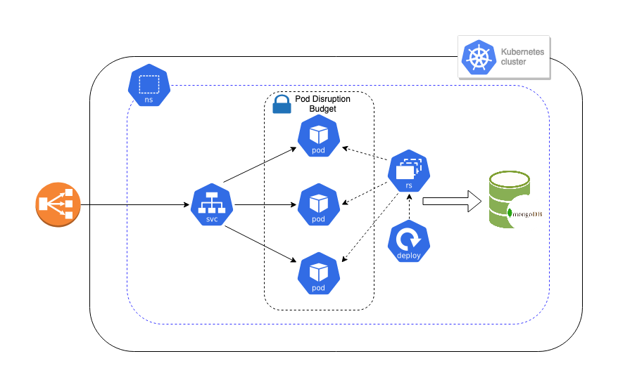

## Preface

* Decision to choose MongoDB was straight forward for me - from previous experience, it's a good choice when it comes to storing user data.

* All *User* struct fields are required, so it's impossible to create a new user without filling out every field. Also, according to RFC, PUT should replace the whole object if it exists, so i'm using Mongo's native *Upsert* function. In ideal scenario the validation logging should be improved and client should get more detailed errors. (see *Potential Improvements*)

* I've chosen Kubernetes cluster as deployment option for this service and assumed that:
    * Kubernetes cluster is already installed and has required capacity
    * Kubernetes cluster architecture and setup/configuration best practices for the major cloud providers are out of the scope of this excercise

## Deployment diagram



## Run instructions

### docker-compose setup

Initial setup:

```bash
$ docker-compose up --build
```

Quick validation:

```
$ curl -v -XPUT -H "Content-Type: application/json" 'http://localhost:3000/hello/john_doe' -d '{
        "username": "john_doe",
        "dateOfBirth": "1965-01-01"
}'

$ curl -v -XGET 'http://localhost:3000/hello/john_doe'
```

Cleanup:

```bash
$ docker-compose down --rmi all --remove-orphans
```

### k8s setup

Initial setup:

```bash
$ cd k8s-manifests
$ kubectl create ns api-users
$ kubectl apply -f k8s-mongo-statefulset.yml # wait for at least 3-5 minutes after all MongoDB replicas become ready since exponential backoff for Mongo connection is not implemented
$ kubectl apply -f k8s-api-configmap.yml
$ kubectl apply -f k8s-api-deployment.yml
```

Zero-downtime service update:

```bash
$ cd k8s-manifests
$ kubectl apply -f k8s-api-deployment.yml
```

Cleanup:

```
$ cd k8s-manifests
$ kubectl delete -f ./
$ kubectl delete ns api-users
```

### Potential improvements (the most obvious ones)

* [CODE] Write meaningful unit and integration tests for custom-baked functions and gin router ¯\\\_(ツ)_/¯ - just did not have enough time for that
* [CODE] Structure and improve application configuration (env variables -> configuration file -> k\v configuration service)
* [CODE] Return custom errors in date processing utility functions
* [CODE] Improve in-app logging (*JSON* format?) and feedback for the client (eg. *JSON* payload validation errors in addition to silent *400* response code).
* [DB] Implement durable logic to maintain *MongoDB* session (some of mgo's calls can cause panic, so it kinda works fine out-of-the-box, but for production usage can be slightly improved). Also, get rid of *service ordering* requirement by implementing exponential and verbose *retries* and when talking with *MongoDB*
* [DB] Add transport layer *TLS\SSL* encryption when talking with *MongoDB*
* [CODE] Instrument code with *Prometheus* metrics
* [CODE] Instrument code with *distributed tracing* library (*Jaeger* is my favorite at the moment)
* [CONTAINER/K8S] Enforce container security by configuring *NetworkPolicies*, *PodSecurityPolicies*, *Linux capabilities* etc.
* [CONTAINER/K8S] Test and improve *Docker\Kubernetes* *SIGTERM/SIGKILL* signals handling
* [K8S] Template *Kubernetes* manifests with *Helm\kustomize\whatever* (*kustomize* is integrated into newer *kubectl* versions, *Helm* is not just a templating engine and it has its own pros and cons)
* [K8S] Think about proper *readiness\liveness* probes - eg. implement */healthz* endpoint and decide if it's needed to include *MongoDB* connectivity check. This is a big holy war topic - some of the big companies are not using *readiness\liveness* at all intentionally - in some cases, they cause more issues than they can solve.
* [K8S] *HorizontalPodAutoscaler* based on *Prometheus* app metrics (*custom metrics* via adapter) or the ones from *Ingress* (*object metrics*)
* [K8S] Add *namespace-wide* limits and quotas
* [K8S] Productionalize *MongoDB Kubernetes* setup (stable *Helm* chart can be used as a starting point)

* [CODE] Potentially go mad until 101% result for *cloud and Kubernetes nativeness* (eg. with *WATCH* method on *API* via *WebSockets*, hot config reloads etc.)

